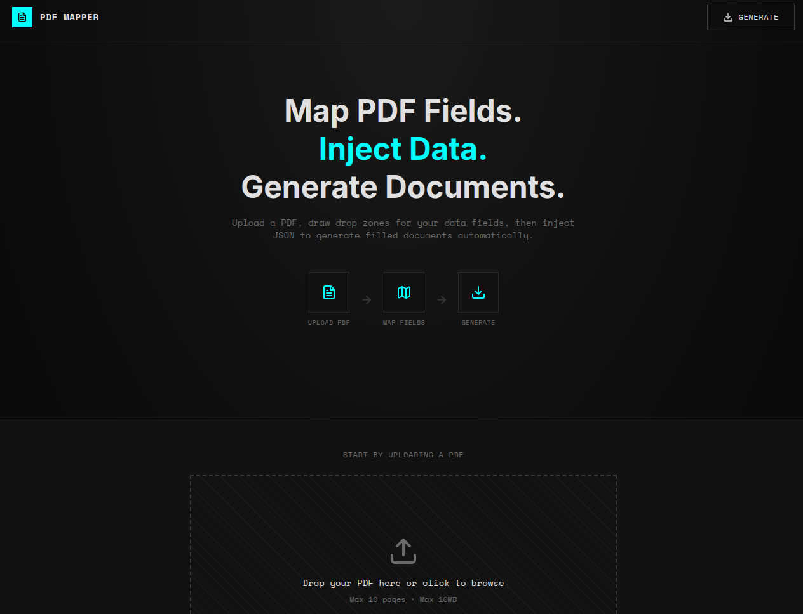
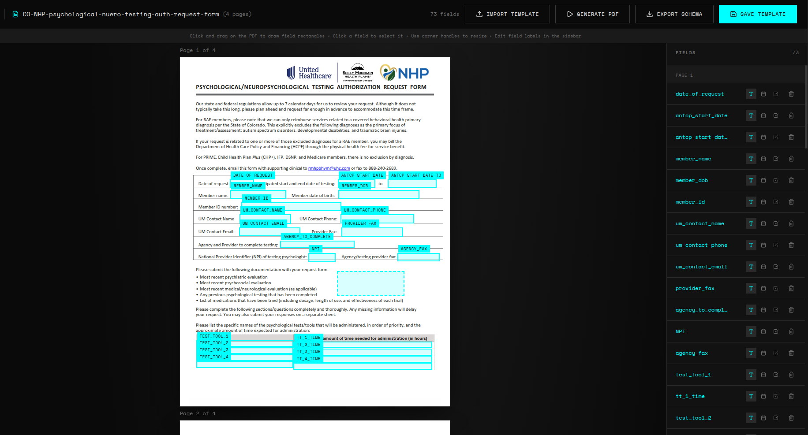
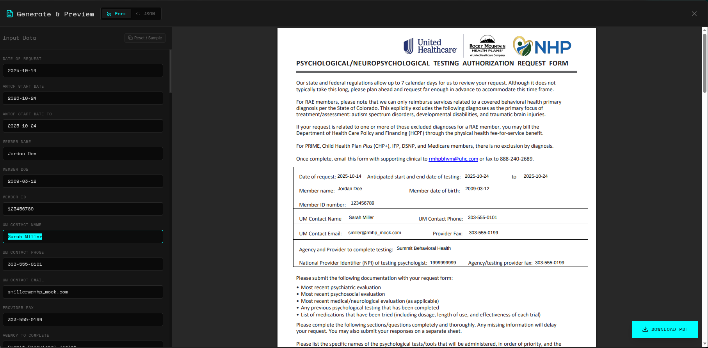

# PDF Mapper & Generator 📄✨

**Stop filling out the same PDF over and over again.**

We've all been there: opening a static PDF form, manually clicking through fields, typing the same data for the hundredth time, and hoping you didn't make a typo. And the next time you need it? You start from scratch.

**PDF Mapper solves this.** It turns your static, flat PDF documents into **dynamic, data-driven templates**.

- **Map Once**: Draw fields on your PDF visually.
- **Generate Infinitely**: Feed it JSON data to create perfect, filled PDFs instantly.
- **Save Your Work**: Export your mapping as a lightweight JSON template.

## 🚀 The Power of Discrete Data Fields

Unlike standard PDF editors where you just "type text," PDF Mapper assigns a **unique JSON key** (e.g., `patient_diagnosis`, `billing_id`) to every box you draw.

This means your PDF is no longer a document—it's an **API Endpoint**.

### AI & EHR Integration Workflows
Because every field relies on structured JSON data, you can automate your documentation flow:
1.  **Ambient AI Scribe**: Have your AI tool listen to a patient visit and output a JSON object.
2.  **EHR Export**: Export patient data from your Electronic Health Record system.
3.  **Instant Generation**: Paste that JSON into PDF Mapper, and your complex, 5-page insurance authorization form is filled instantly and accurately.

## 🛠️ Tech Stack

- **Framework**: [Next.js 14](https://nextjs.org/) (App Router)
- **Styling**: [Tailwind CSS](https://tailwindcss.com/)
- **PDF Engine**: [pdf-lib](https://pdf-lib.js.org/) (Client-side generation)
- **State Management**: [Zustand](https://github.com/pmndrs/zustand)

## 🗺️ Roadmap

- [x] Client-Side Visual Mapping
- [x] Live Preview & Generation
- [x] Form & JSON Input Modes
- [ ] **Python API Service**: A dedicated backend service to allow AI Agents (like ChatGPT/Gemini) to "call" this tool as an API function to generate PDFs programmatically without a UI.

## 📦 Usage Guide

1. **Upload**: Select your blank PDF.
2. **Map**: Draw boxes. Each box represents a discrete data field in your future JSON.
3. **Generate**: Provide the data.
   - **Form View**: Use the auto-generated form for quick, granular edits.
     
     
     
   - **JSON View**: Switch to JSON mode to paste entire datasets or API payloads.
     
     

   *The PDF preview updates automatically in real-time.*
4. **Download**: Get your flattened, production-ready PDF.

---
*Built with ❤️ for efficiency.*
